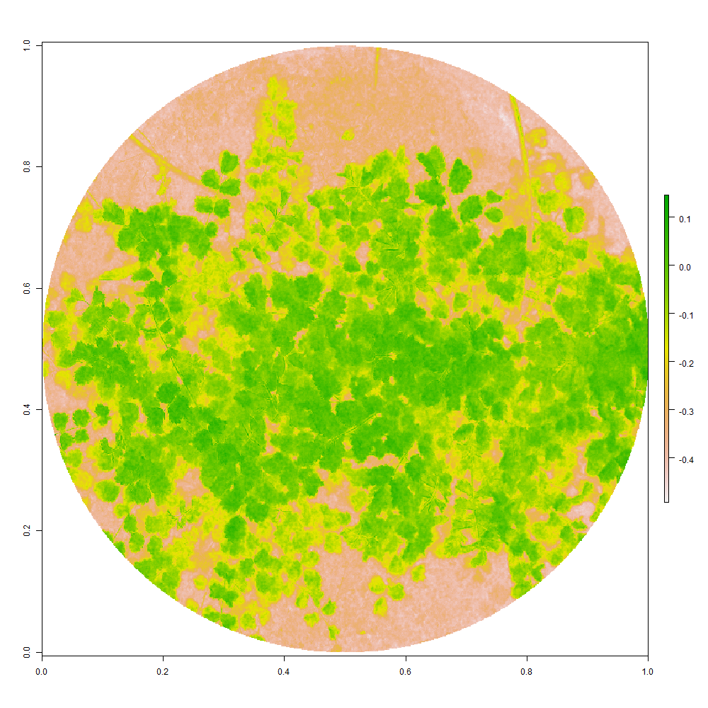

# Introduction

This is a package simplification from [PhotomossR](https://github.com/MMolBus/PhotomossR). 
This set of R functions enables to measure plant area and estimates photosynthetic activity using the NDVI.

This document is a tutorial to show how to use the package.  

# Tutorial
## Set working directory structure

First of all we need a working directory structure as shown in (_*Figure \@ref(fig:WD-structure)*_).

* JPG folder: in our case with Orange + Cyan + NIR in JPG format (_*Figure \@ref(fig:OCN-example)*_).

* rois folder: contains binary masks with .tif rasters obtained with ImageJ. This mask allow us to obtain the area of interest from JPG pictures pictures were we  want to calculate NDVI.
Observe that each tif need to be in a subfolder. Mask file and subfolder need to have the same name as sample file (_*Figure \@ref(fig:mask-example)*_.)


```{r WD-structure, echo=FALSE, fig.cap = "_Working directory structure._"}
knitr::include_graphics("working_directory_structure.png")
```


```{r OCN-example, echo=FALSE, fig.cap = "_Orange + Cyan + NIR image example. We need to incluide a color chart that we will use to calibrate color levels._"}
knitr::include_graphics("OCN-example.jpg")
```


```{r mask-example, echo=FALSE, fig.cap = "_Mask example obtained from imageJ. White area delimitates the area where we want to calculate NDVI._"}
knitr::include_graphics("mask-example.jpg")
```
##RECOMENDATION

Because may be we will want to make some adjustments to the calculated NDVI. Only put one sample in the mandatory folders the first time you run this code.

## Install required packages
We install CIDE package.

```{r install librarian, echo= T, results = 'hide'}
## install librarian
if(require(librarian)==F){
  install.packages("librarian")
  library(librarian)
}else{
  library(librarian)
}
```

```{r install our packages, echo= T, results = 'hide'}
# install required packages an libraries
librarian::shelf(MMolbus/CIDE, MMolbus/MButils )
```


## Set working directory 
Set working directory and define picture and roi folders 

```{r set working directory show and not eval, eval=FALSE}
# define your working directory
wd <- "./my_wd"
setwd(wd)

```


```{r set working directory not eval, eval=FALSE, echo=TRUE}

# define sample picture (JPG) directory
pic_wd <-
  list.dirs(wd, recursive = T)[
    grep("JPG$",  list.dirs(wd, recursive = T))
  ]

# define (mask) directory
roi_wd <-
  list.dirs(wd, recursive = T)[
    grep("rois$",  list.dirs(wd, recursive = T))
  ]

```

```{r set working directory eval, eval=TRUE, echo=FALSE}

# define sample picture (JPG) directory
pic_wd <-
  list.dirs(getwd(), recursive = T)[
    grep("JPG$",  list.dirs(getwd(), recursive = T))
  ]

# define (mask) directory
roi_wd <-
  list.dirs(getwd(), recursive = T)[
    grep("rois$",  list.dirs(getwd(), recursive = T))
  ]

```

## Set color chart tile positions
Use _*chart2*_ function to set color tiles positions. Click over the sample image folowing the order shown in _*Figure \@ref(fig:chart)*_ 
you only need to run one time by image series

```{r chart not eval, eval= FALSE}
## get chart tiles positions using chart2 function.
chart <- chart2(pic.path= pic_wd,
                pic.format = "jpg")


```
```{r chart  eval, echo=FALSE}
## get chart tiles positions using chart2 function.
chart <- readRDS("chart.rds")
```

```{r chart, echo=FALSE, fig.cap = "_Color tile clicking order when using *chart2* function._"}
knitr::include_graphics("chart.jpg")
```

Save color chart polygon position in rds format in results folder. If folder do not exists, create it 
```{r create results folder}
# create results folder
if(dir.exists("results")==F){
  dir.create("results")
}
  
```

```{r save chart}
# save chart as rds file
saveRDS(chart, "./results/chart.rds")

```


##Import mask files with the region of interest

Mask raster files  delimitates the observation area where we want to calculate the NDVI.
```{r}
# get mask filenames
msk_name <-
  list.files(
    path = roi_wd,
    pattern = ".tif$",
    full.names = T,
    recursive = T
  )

# Import masks rasters as list
obs.areas <-
  lapply(seq_along(msk_name), function(i)
    tif2raster(msk_name[i]))
               
```

##Now make the calculations.
We are ready to try with one sample image to see if the NDVI calculation is correct.
Put one sample image and its respective mask following the configuration of 
```{r test with one sample, eval = F}
ccspectral.df(tif.path = wd,
              chart,
              obs.areas,
              pdf = F,
              calculate.thresh = F,
              descrip = T,
              manual.mask.test = F,
              index. = c("NDVI"),
              threshold.method = NULL,
              threshold.vector = 0.4,
              descriptors. =
                c("median","mean","sd","min",
                  "max","diff.range" )
)

```

# Results evaluation and corrections

Now that we have the first NDVI calculated we make a first evaluation of data results. 

Ussually NDVI values between 0.2 and 0.4 correspond to areas with scarce vegetation; moderate vegetation tends to vary between 0.4 and 0.6; while any value above 0.6 indicates the highest possible density of green leaves.

Values below 0.2 are supposed to be soil or dead material.

In our case we have a absolute erroneous NDVI value, but with a correct correspondence between soil and plant areas. Is seems that NDVI has draged to negative nonsense values _*Figure \@ref(fig:NDVI_error)*_ 

```{r NDVI_error, echo=FALSE, fig.cap = "_First NDVI obtained with nonsense negative values._"}


```


To fix this error we will take as reference the bare soil from the image
<!-- # obs.areas <- roi2polygon.2(roi.paths = obs.areas, tif.path = tif.path) -->


