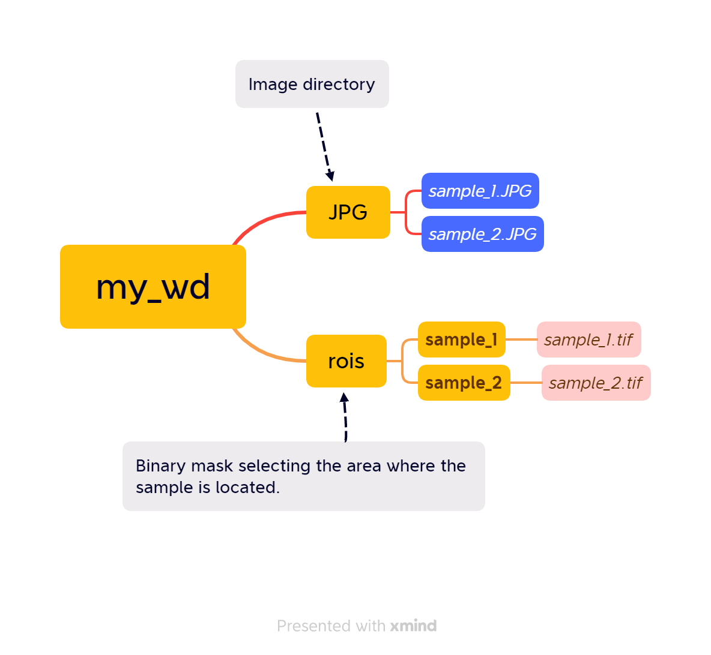

<!-- ```{r setup, include=FALSE} -->
<!-- knitr::opts_chunk$set(echo = TRUE) -->
<!-- ``` -->

# Introduction

This is a package simplification from [PhotomossR](https://github.com/MMolBus/PhotomossR). 
This set of R functions enables to measure plant area and estimates photosynthetic activity using the NDVI.

This document is a tutorial to show how to use the package.  

# Tutorial
## Set working directory structure

First of all we need a working directory structure as shown in (_*Figure \@ref(fig:WD-structure)*_).

* JPG folder: in our case with Orange + Cyan + NIR in JPG format (_*Figure \@ref(fig:OCN-example)*_).

* rois folder: contains binary masks with .tif rasters obtained with ImageJ. This mask allow us to obtain the area of interest from JPG pictures pictures were we  want to calculate NDVI.
Observe that each tif need to be in a subfolder. Mask file and subfolder need to have the same name as sample file (_*Figure \@ref(fig:mask-example)*_.)


```{r WD-structure, echo=FALSE, fig.cap = "_Working directory structure._"}

```


```{r OCN-example, echo=FALSE, fig.cap = "_Orange + Cyan + NIR image example. We need to incluide a color chart that we will use to calibrate color levels._"}
knitr::include_graphics("OCN-example.jpg")
```


```{r mask-example, echo=FALSE, fig.cap = "_Mask example obtained from imageJ. White area delimitates the area where we want to calculate NDVI._"}

```

## Install required packages
We install CIDE package.

```{r install librarian, echo= T, results = 'hide'}
## install librarian
if(require(librarian)==F){
  install.packages("librarian")
  library(librarian)
}else{
  library(librarian)
}
```

```{r install packages, echo= T, results = 'hide'}
# install required packages an libraries
librarian::shelf(MMolbus/CIDE, MMolbus/MButils )
```


## Set working directory 
Set working directory and define picture and roi folders 

```{r set working directory show and not eval, eval=FALSE}
# define your working directory
wd <- "./my_wd"
setwd(wd)

```


```{r set working directory not eval, eval=FALSE, echo=TRUE}

# define sample picture (JPG) directory
pic_wd <-
  list.dirs(wd, recursive = T)[
    grep("JPG$",  list.dirs(wd, recursive = T))
  ]

# define (mask) directory
roi_wd <-
  list.dirs(wd, recursive = T)[
    grep("rois$",  list.dirs(wd, recursive = T))
  ]

```

```{r set working directory eval, eval=TRUE, echo=FALSE}

# define sample picture (JPG) directory
pic_wd <-
  list.dirs(getwd(), recursive = T)[
    grep("JPG$",  list.dirs(getwd(), recursive = T))
  ]

# define (mask) directory
roi_wd <-
  list.dirs(getwd(), recursive = T)[
    grep("rois$",  list.dirs(getwd(), recursive = T))
  ]

```


```{r cars}
summary(cars)
```


You can also embed plots, for example:

```{r pressure, echo=FALSE}
plot(pressure)
```

Note that the `echo = FALSE` parameter was added to the code chunk to prevent printing of the R code that generated the plot.
