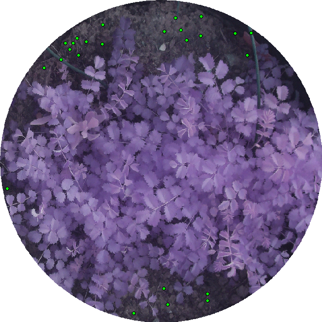

Tutorial: CIDE protocol to measure plant area and NDVI values.
================
Manuel Molina-Bustamante
3/5/2023

# Introduction

This is a package simplification from
[PhotomossR](https://github.com/MMolBus/PhotomossR). This set of R
functions enables to measure plant area and estimates photosynthetic
activity using the NDVI.

This document is a tutorial to show how to use the package.

# Tutorial

## Set working directory structure

First of all we need a working directory structure as shown in (**Figure
@ref(fig:WD-structure)**).

-   JPG folder: in our case with Orange + Cyan + NIR in JPG format
    (**Figure @ref(fig:OCN-example)**).

-   rois folder: contains binary masks with .tif rasters obtained with
    ImageJ. This mask allow us to obtain the area of interest from JPG
    pictures pictures were we want to calculate NDVI. Observe that each
    tif need to be in a subfolder. Mask file and subfolder need to have
    the same name as sample file (**Figure @ref(fig:mask-example)**.)

<div class="figure">


<p class="caption">
*Working directory structure.*
</p>

</div>

<div class="figure">


<p class="caption">
*Orange + Cyan + NIR image example. We need to incluide a color chart
that we will use to calibrate color levels.*
</p>

</div>

<div class="figure">


<p class="caption">
*Mask example obtained from imageJ. White area delimitates the area
where we want to calculate NDVI.*
</p>

</div>

\##RECOMENDATION

Because may be we will want to make some adjustments to the calculated
NDVI. Only put one sample in the mandatory folders the first time you
run this code.

## Install required packages

We install CIDE package.

``` r
## install librarian
if(require(librarian)==F){
  install.packages("librarian")
  library(librarian)
}else{
  library(librarian)
}
```

    ## Loading required package: librarian

``` r
# install required packages an libraries
librarian::shelf(MMolbus/CIDE, MMolbus/MButils )
```

    ## 
    ##   The 'cran_repo' argument in shelf() was not set, so it will use
    ##   cran_repo = 'https://cran.r-project.org' by default.
    ## 
    ##   To avoid this message, set the 'cran_repo' argument to a CRAN
    ##   mirror URL (see https://cran.r-project.org/mirrors.html) or set
    ##   'quiet = TRUE'.

## Set working directory

Set working directory and define picture and roi folders

``` r
# define your working directory
wd <- "./my_wd"
setwd(wd)
```

``` r
# define sample picture (JPG) directory
pic_wd <-
  list.dirs(wd, recursive = T)[
    grep("JPG$",  list.dirs(wd, recursive = T))
  ]

# define (mask) directory
roi_wd <-
  list.dirs(wd, recursive = T)[
    grep("rois$",  list.dirs(wd, recursive = T))
  ]
```

## Set color chart tile positions

Use **chart2** function to set color tiles positions. Click over the
sample image folowing the order shown in **Figure @ref(fig:chart)** you
only need to run one time by image series

``` r
## get chart tiles positions using chart2 function.
chart <- chart2(pic.path= pic_wd,
                pic.format = "jpg")
```

<div class="figure">


<p class="caption">
*Color tile clicking order when using *chart2* function.*
</p>

</div>

Save color chart polygon position in rds format in results folder. If
folder do not exists, create it

``` r
# create results folder
if(dir.exists("results")==F){
  dir.create("results")
}
```

``` r
# save chart as rds file
saveRDS(chart, "./results/chart.rds")
```

\##Import mask files with the region of interest

Mask raster files delimitates the observation area where we want to
calculate the NDVI.

``` r
# get mask filenames
msk_name <-
  list.files(
    path = roi_wd,
    pattern = ".tif$",
    full.names = T,
    recursive = T
  )

# Import masks rasters as list
obs.areas <-
  lapply(seq_along(msk_name), function(i)
    tif2raster(msk_name[i]))
```

\##Now make the calculations. We are ready to try with one sample image
to see if the NDVI calculation is correct. Put one sample image and its
respective mask following the configuration of

``` r
ccspectral.df(tif.path = wd,
              chart,
              obs.areas,
              pdf = F,
              calculate.thresh = F,
              descrip = T,
              manual.mask.test = F,
              index. = c("NDVI"),
              threshold.method = NULL,
              threshold.vector = 0.4,
              descriptors. =
                c("median","mean","sd","min",
                  "max","diff.range" )
)
```

# Results evaluation and corrections

Now that we have the first NDVI calculated we make a first evaluation of
data results.

Usually NDVI values between 0.2 and 0.4 correspond to areas with scarce
vegetation; moderate vegetation tends to vary between 0.4 and 0.6; while
any value above 0.6 indicates the highest possible density of green
leaves.

Values below 0.2 are supposed to be soil or dead material.

In our case we have a absolute NDVI value that not fit with logic
expected values, meanwhile reelative values seems to have sense between
soil and plant areas. Is seems that NDVI has draged to negative nonsense
values **Figure @ref(fig:NDVI_error)**

<div class="figure">


<p class="caption">
*First NDVI obtained with nonsense negative values.*
</p>

</div>

To fix this error we will take as reference the bare soil from the
image. To do that we use the *sample.soil.points* function. This
function asks you to mark the points in the photograph where you can
find ground. The argument ‘sample.points’ allows you to set the number
of points you want to take as a sample, and the argument ‘samp.width’
allows you to determine the width of the sample, which determines the
number of pixels that will be taken in each sample. @ref(fig:sample soil
plot)

``` r
# run sample.soil.points
sample_points <-
  sample.soil.points(
    pic.path = list.files(pic_wd, full.names = T)[1],
    samp.width = 0.005,
    pic.format = "jpg",
    roi.area = obs.areas[[1]],
    sample.points = 25
  )
```

<div class="figure">


<p class="caption">
*Example points over the image to find soil locations.*
</p>

</div>

Select the maximum value from our calculated ndvi values (We use the
first calculated ndvi).

``` r
# read raster result saved in .rds value in the results folder   
r <- readRDS("./results/output YYYY-MM-DD manual/raster_results/sample1.rds")
```

``` r
# extract ndvi values from soil locations
soil_values <- numeric()
i <- 1
for (i in seq_along(sample_points)) {
  poly <- sample_points[i]
  df_samp <- data.frame(extract(r[["NDVI"]],
                                poly))
  options(warn = 0)
  # if (nrow(df_samp) >= 50) {
  #     df_samp <- df_samp[sample(x = 1:nrow(df_samp), size = 50,
  #                               replace = F), ]
  soil_values <- rbind(soil_values, df_samp[1, ])
  rm(df_samp, poly)
}
 
# And get the correction that we need to apply to the calculated ndvi.
# In our case we expect a maximum soil ndvi  of 0.2  

ndvi_correction <- 0.2-max(soil_values)
# [1] 0.3027424

# we need to sum 0.3027424 to the calculated ndvi
```

Now we recalculate ndvi adding the ndvi_correction, we use the arguments
index.correction and index.correction.value.

``` r
# we recalculate ndvi values
ccspectral.df(tif.path = wd,
              chart,
              obs.areas,
              pdf = F,
              calculate.thresh = F,
              descrip = T,
              manual.mask.test = F,
              index. = c("NDVI"),
              threshold.method = NULL,
              threshold.vector = 0.4,
              index.correction = T,
              index.correction.value = ndvi_correction,
              descriptors. =
                c("median","mean","sd","min",
                  "max","diff.range" )
)
```

<!-- # obs.areas <- roi2polygon.2(roi.paths = obs.areas, tif.path = tif.path) -->
