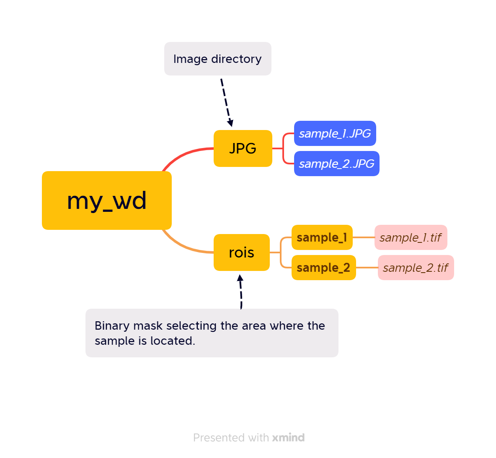

Tutorial: CIDE protocol to measure plant area and NDVI values.
================
Manuel Molina-Bustamante
3/5/2023

# Introduction

This is a package simplification from
[PhotomossR](https://github.com/MMolBus/PhotomossR). This set of R
functions enables to measure plant area and estimates photosynthetic
activity using the NDVI.

This document is a tutorial to show how to use the package.

# Tutorial

## Set working directory structure

First of all we need a working directory structure as shown in (**Figure
[1](#figura1)**).

-   JPG folder: in our case with Orange + Cyan + NIR in JPG format
    (**Figure @ref(fig:OCN-example)**).

-   rois folder: contains binary masks with .tif rasters obtained with
    ImageJ. This mask allow us to obtain the area of interest from JPG
    pictures pictures were we want to calculate NDVI. Observe that each
    tif need to be in a subfolder. Mask file and subfolder need to have
    the same name as sample file (**Figure @ref(fig:mask-example)**.)

<a name="figure1"></a>

[Working directory structure.]

</div>

<div class="figure">


<p class="caption">
*Orange + Cyan + NIR image example. We need to incluide a color chart
that we will use to calibrate color levels.*
</p>

</div>

<div class="figure">


<p class="caption">
*Mask example obtained from imageJ. White area delimitates the area
where we want to calculate NDVI.*
</p>

</div>

## Install required packages

We install CIDE package.

``` r
## install librarian
if(require(librarian)==F){
  install.packages("librarian")
  library(librarian)
}else{
  library(librarian)
}
```

    ## Loading required package: librarian

``` r
# install required packages an libraries
librarian::shelf(MMolbus/CIDE, MMolbus/MButils )
```

    ## 
    ##   The 'cran_repo' argument in shelf() was not set, so it will use
    ##   cran_repo = 'https://cran.r-project.org' by default.
    ## 
    ##   To avoid this message, set the 'cran_repo' argument to a CRAN
    ##   mirror URL (see https://cran.r-project.org/mirrors.html) or set
    ##   'quiet = TRUE'.

## Set working directory

Set working directory and define picture and roi folders

``` r
# define your working directory
wd <- "./my_wd"
setwd(wd)
```

``` r
# define sample picture (JPG) directory
pic_wd <-
  list.dirs(wd, recursive = T)[
    grep("JPG$",  list.dirs(wd, recursive = T))
  ]

# define (mask) directory
roi_wd <-
  list.dirs(wd, recursive = T)[
    grep("rois$",  list.dirs(wd, recursive = T))
  ]
```

## Set color chart tile positions

Use **chart2** function to set color tiles positions. Click over the
sample image folowing the order shown in (**Figure @ref(fig:chart)**)
you only need to run one time by image series

``` r
## get chart tiles positions using chart2 function--------------------------------
chart <- chart2(pic.path= pic_wd,
                pic.format = "jpg")
```

<div class="figure">


<p class="caption">
*Color tile clicking order when using *chart2* function.*
</p>

</div>
