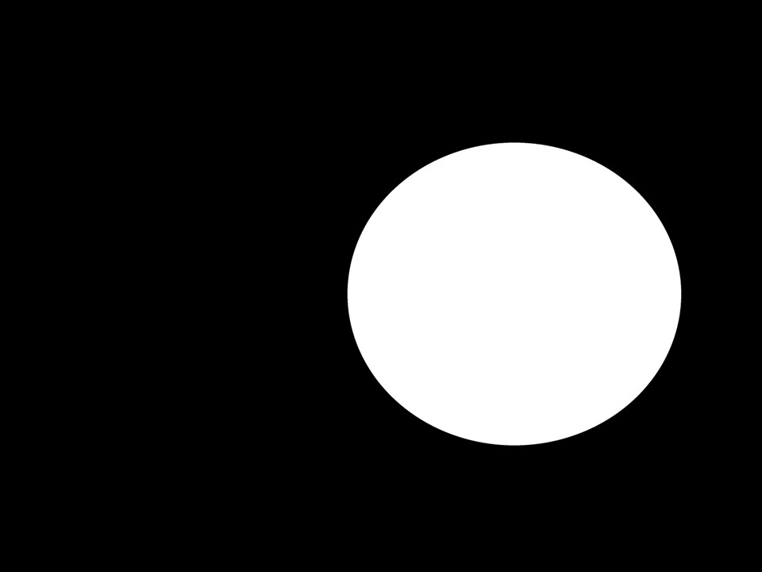

Tutorial: CIDE protocol to measure plant area and NDVI values.
================
Manuel Molina-Bustamante
3/5/2023

# Introduction

This is a simplified package derived from [PhotomossR](https://github.com/MMolBus/PhotomossR). This collection of R functions enables the measurement of plant area and the estimation of photosynthetic activity using NDVI.

This document is a tutorial designed to demonstrate how to use the package.

# Tutorial

## Set working directory structure

First of all, we need a working directory structure as shown in **Figure 1** (referenced as **[\#figura1](#figura1)**).

- JPG folder: contains Orange + Cyan + NIR channels in JPG format (referenced as **Figure 2** **[\#figura2](#figura2)**).

- rois folder: contains binary masks with .tif rasters obtained with ImageJ. These masks allow us to obtain the area of interest from JPG pictures where we want to calculate NDVI. Note that each tif file needs to be in a subfolder. The mask file and subfolder should have the same name as the sample file (**Figure 3** **[\#figura3](#figura3)**).

<a name="figure1"></a>

Figure 1: *Working directory structure*.

</div>

<a name="figure2"></a>

Figure 2: *Orange + Cyan + NIR image example. We need to incluide a color chart
that we will use to calibrate color levels*.

</div>

<a name="figure3"></a>

Figure 3: *Mask example obtained from imageJ. White area delimitates the area
where we want to calculate NDVI*.

</div>

## Install required packages

We install CIDE package.

``` r
## install librarian
if(require(librarian)==F){
  install.packages("librarian")
  library(librarian)
}else{
  library(librarian)
}
```

    ## Loading required package: librarian

``` r
# install required packages an libraries
librarian::shelf(MMolbus/CIDE, MMolbus/MButils )
```

    ## 
    ##   The 'cran_repo' argument in shelf() was not set, so it will use
    ##   cran_repo = 'https://cran.r-project.org' by default.
    ## 
    ##   To avoid this message, set the 'cran_repo' argument to a CRAN
    ##   mirror URL (see https://cran.r-project.org/mirrors.html) or set
    ##   'quiet = TRUE'.

## Set working directory

Set working directory and define picture and roi (mask) folders

``` r
# define your working directory
wd <- "./my_wd"
setwd(wd)
```

``` r
# define sample picture (JPG) directory
pic_wd <-
  list.dirs(wd, recursive = T)[
    grep("JPG$",  list.dirs(wd, recursive = T))
  ]

# define (mask) directory
roi_wd <-
  list.dirs(wd, recursive = T)[
    grep("rois$",  list.dirs(wd, recursive = T))
  ]
```

## Set color chart tile positions

Use the **chart2** function to set the positions of the color tiles. Click on the sample image, following the order shown in **Figure 4** (referenced as **[\#figura4](#figura4)**). You only need to run this once per image series.

``` r
## get chart tiles positions using chart2 function--------------------------------
chart <- chart2(pic.path= pic_wd,
                pic.format = "jpg")
```

<a name="figure4"></a>

Figure 4: *Color tile clicking order when using **chart2** function*.

</div>
